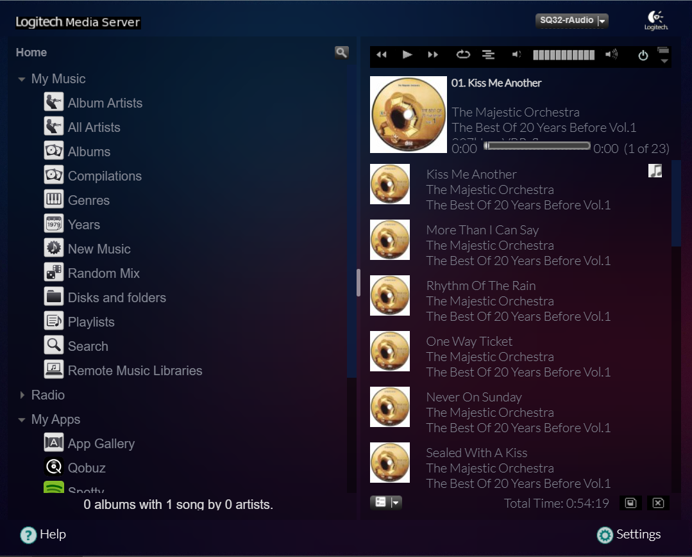

# LMS modern-skin for LMS-rAudio
Download and Extract
> wget https://raw.githubusercontent.com/lovehifi/lms-modern-skin/main/css.tgz
> wget https://raw.githubusercontent.com/lovehifi/lms-modern-skin/main/image.tgz
> tar -xzvf css.tgz -C /opt/logitechmediaserver-git/HTML/Default/
> tar -xzvf image.tgz -C /opt/logitechmediaserver-git/HTML/Default/html/images/
> systemctl restart logitechmediaserver-git.service
Delete the cache of your browser.

