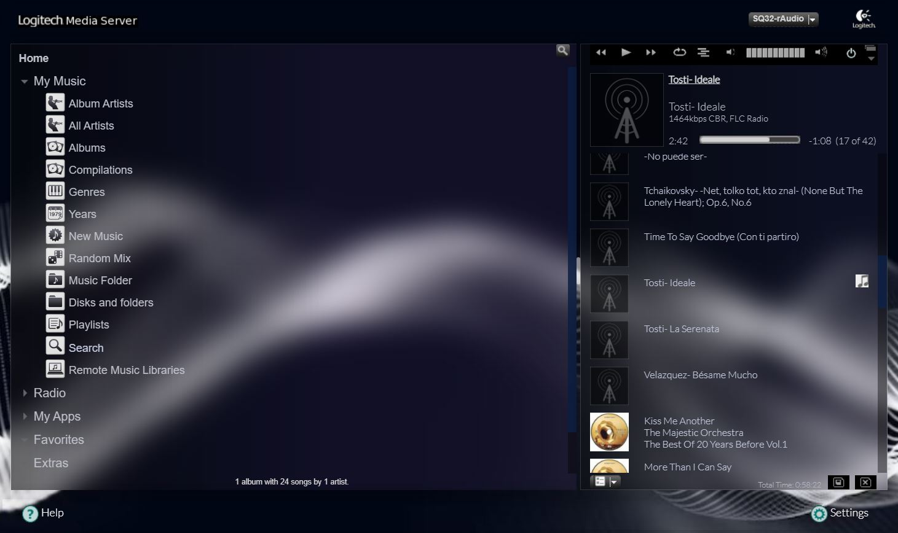
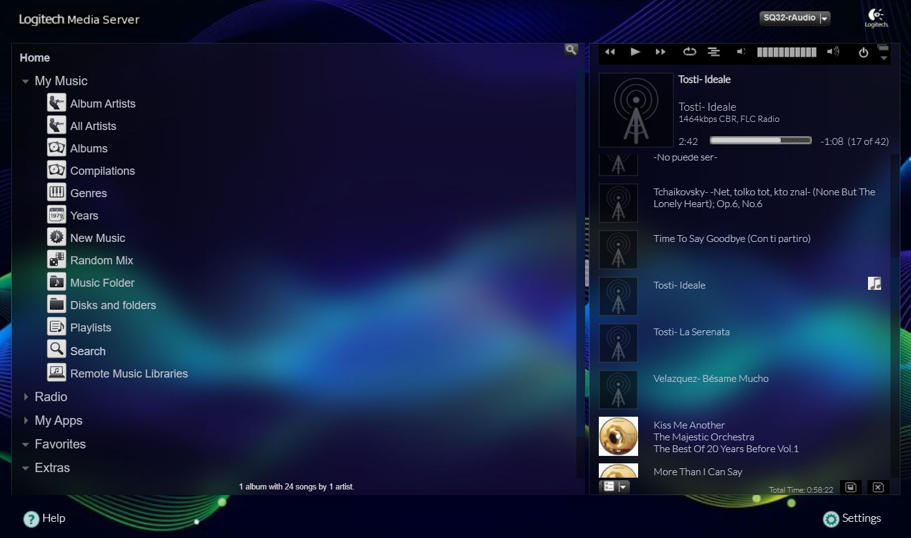
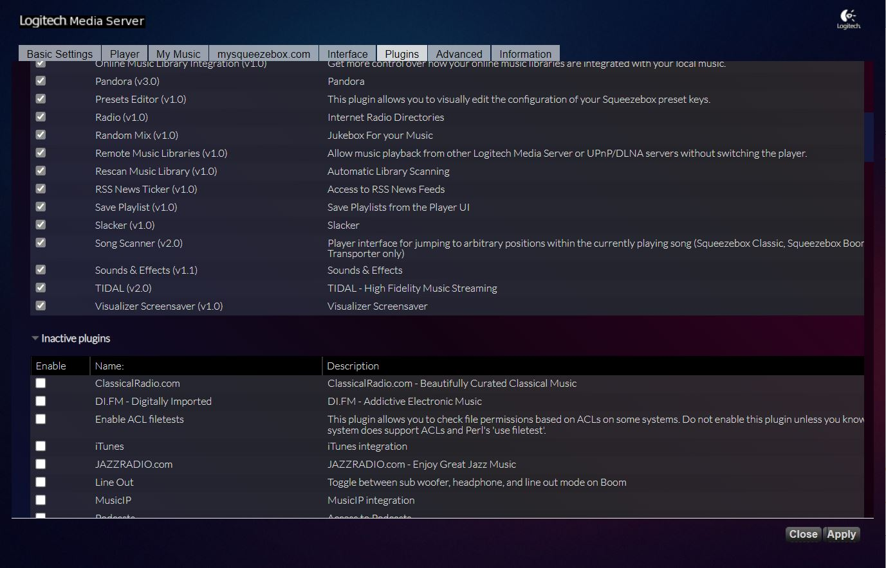

# LMS modern-skin for LMS-rAudio
LMS on rAudio (https://github.com/rern/rAudio)
>
Download css, image and Extract
> wget -O - https://raw.githubusercontent.com/lovehifi/lms-modern-skin/main/install.sh | sh
>
>
Clear the cache of your browser.

You can replace the background image with the name 'background.jpg' at the location:
>
> /opt/logitechmediaserver-git/HTML/Default/html/images/background.jpg.
>
Like this, a sample image from https://impossibleimages.ai
>
>

>

>
[Free the background at freepik.com](https://www.freepik.com/search?format=search&page=2&query=equalizer+wave+background)
>

>

>

>
