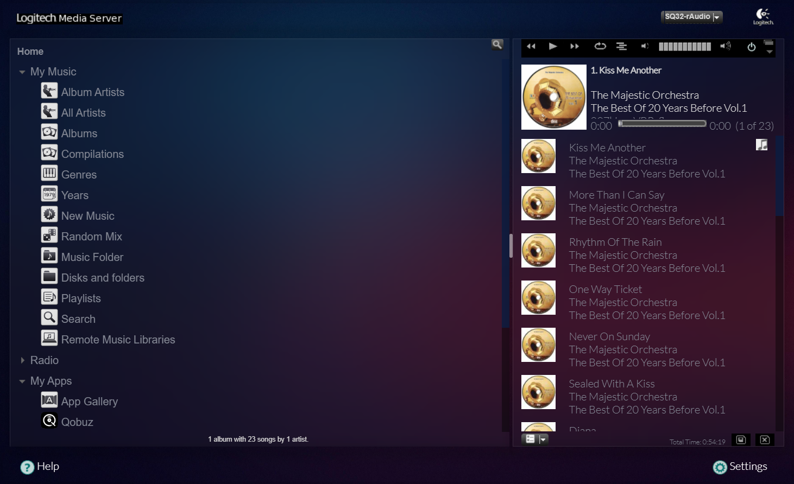
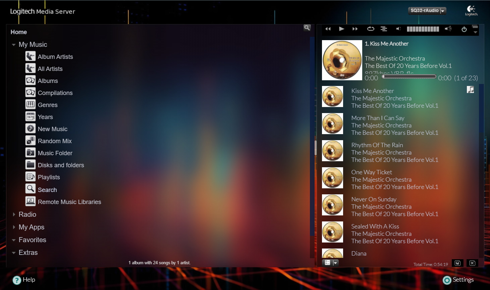

# LMS modern-skin for LMS-rAudio
Download and Extract
> wget -O - https://raw.githubusercontent.com/lovehifi/lms-modern-skin/main/install.sh | sh
>
>
Delete the cache of your browser.

You can replace the background image with the name 'cover.jpg' at the location:
/opt/logitechmediaserver-git/HTML/Default/html/images/cover.jpg.

Like this, a sample image 

